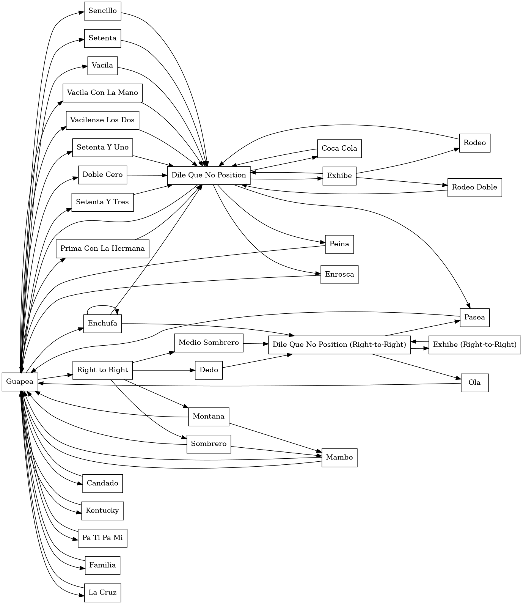
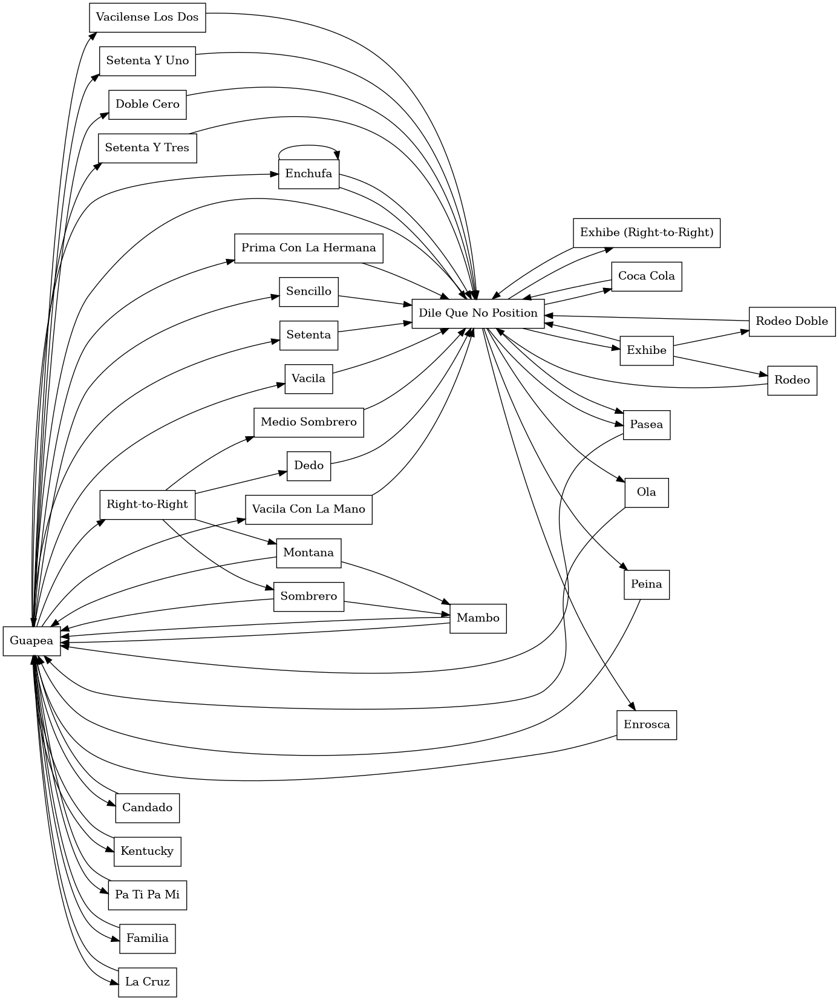

# Salsa

[](https://mybinder.org/v2/gh/adharsh/salsa/master)

It's kinda cool that you can probably represent cuban salsa social dance moves as a finite state machine and use it to generate choreo

To generate social dance choreo, just need to traverse the graph and stop when your follower passes out. To run, click on the above button.

Preferred & interactive way to visualize data:
```bash
xdot social.dot
xdot social_all_dile_que_no_is_same.dot
```

To generate the `social_all_dile_que_no_is_same.dot` file, run:
```bash
./all_dile_que_no_is_same.sh
```






Note: Not sure if all dile que no's can be treated the same, hence the two different images above.
